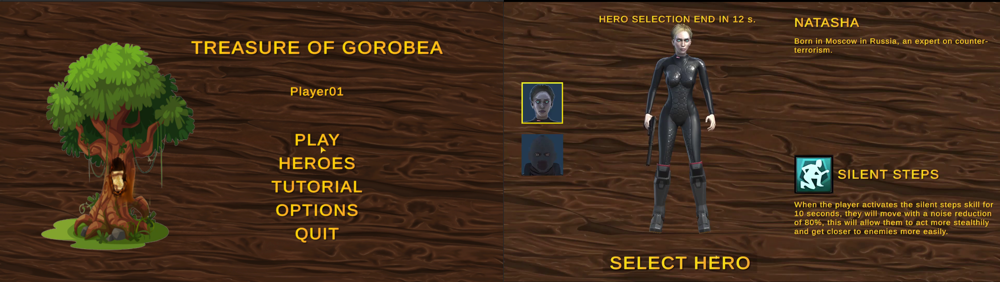

# Treasure of Gorobea
This is an online game developed for the course Online Game Design at University of Milan.

The course included constraint to choose what kind of game to develop. So according to the constraint we choose to develop the battle royale Treasure of Gorobea.

## About the project

The game is set in the Gorobea forest where there will be a special tree, the highest one in the forest. The position of the tree will always be different at every match. To this tree is attached a map indicating the position of the treasure. There will be many players, all the players will be able to see the treasure map on the tree and search for the treasure. The problem is that the player is a killer like all other ones, he can kill everyone in order to easily find the treasure or he can play the match in a completely stealth way. The goal of the games is to read the treasure map on the tree and find the treasure without being discovered or killed by the other players.

---

